# 🔄 RFS_STORE WORKFLOW

## Complete System Flow

```mermaid
flowchart TD
    Start([Customer Visit Website]) --> Register{Registered?}
    Register -->|No| SignUp[Sign Up<br/>+ Telegram ID optional]
    Register -->|Yes| Login[Login]
    SignUp --> Login
    
    Login --> Browse[Browse Services<br/>6 services available]
    Browse --> SelectService[Select Service<br/>e.g., Jasa Website]
    
    SelectService --> FillOrder[Fill Order Form<br/>Description, Urgency, Deadline]
    FillOrder --> SubmitOrder[Submit Order]
    
    SubmitOrder --> OrderCreated[Order Created<br/>Status: pending]
    OrderCreated --> NotifyAdmin1[📱 Notify Admins<br/>Telegram + WhatsApp]
    
    NotifyAdmin1 --> AdminReview{Admin Review Order}
    AdminReview --> StartProcess[Update Status<br/>Status: processing]
    StartProcess --> NotifyCustomer1[📱 Notify Customer<br/>Order being processed]
    
    NotifyCustomer1 --> AdminWork[Admin Work on Order]
    AdminWork --> CompleteOrder[Admin Click<br/>Complete Order]
    
    CompleteOrder --> AutoInvoice[🤖 AUTO: Create Invoice<br/>Amount: 0 placeholder]
    AutoInvoice --> NotifyAdminSetPrice[📱 Notify Admin<br/>Set invoice amount]
    
    NotifyAdminSetPrice --> AdminSetPrice[Admin Set Amount<br/>e.g., Rp 5,000,000]
    AdminSetPrice --> NotifyCustomer2[📱 Notify Customer<br/>Invoice ready + amount]
    
    NotifyCustomer2 --> CustomerPay{Customer Pay}
    CustomerPay -->|Website| UploadProof1[Upload Payment Proof<br/>via Website]
    CustomerPay -->|WhatsApp| SendPhotoWA[Send Photo<br/>via WhatsApp to Admin]
    
    UploadProof1 --> PaymentPending[Payment Status: pending]
    SendPhotoWA --> PaymentPending
    PaymentPending --> NotifyAdminPayment[📱 Notify Admins<br/>Payment proof received]
    
    NotifyAdminPayment --> AdminVerify{Admin Verify<br/>Payment Proof}
    AdminVerify -->|Reject| RejectPayment[Status: rejected<br/>Request re-upload]
    AdminVerify -->|Approve| ApprovePayment[Status: verified<br/>Invoice: paid]
    
    RejectPayment --> NotifyCustomer3[📱 Notify Customer<br/>Payment rejected]
    NotifyCustomer3 --> CustomerPay
    
    ApprovePayment --> NotifyCustomer4[📱 Notify Customer<br/>Payment verified ✅]
    NotifyCustomer4 --> AdminSendResult[Admin Upload Result<br/>File or Google Drive link]
    
    AdminSendResult --> NotifyCustomer5[📱 Notify Customer<br/>Result ready + download link]
    NotifyCustomer5 --> OrderComplete[Order Complete ✅]
    OrderComplete --> End([End])
    
    style Start fill:#e1f5fe
    style End fill:#c8e6c9
    style AutoInvoice fill:#fff9c4
    style NotifyAdmin1 fill:#ffe0b2
    style NotifyCustomer2 fill:#ffe0b2
    style NotifyAdminPayment fill:#ffe0b2
    style NotifyCustomer4 fill:#ffe0b2
    style NotifyCustomer5 fill:#ffe0b2
    style OrderComplete fill:#a5d6a7
```

## Key Points

### 🤖 Automated
- Invoice creation when order completed
- All notifications (Telegram + WhatsApp)
- Profile creation on signup
- Payment proof alerts

### 👤 Manual
- Set invoice amount (flexible pricing)
- Verify payment proof
- Upload result files

### 📱 Notifications
**Admins receive:**
- New orders
- Payment proofs

**Customers receive:**
- Order status updates
- Invoice ready
- Payment verification
- Result delivery

---

## Setup

1. Run `COMPLETE_DATABASE_PRODUCTION.sql` in Supabase
2. Login as admin1@rfsstore.com or admin2@rfsstore.com
3. Test complete workflow

**Admin Credentials:**
- admin1@rfsstore.com / Admin@123
- admin2@rfsstore.com / Admin@123

